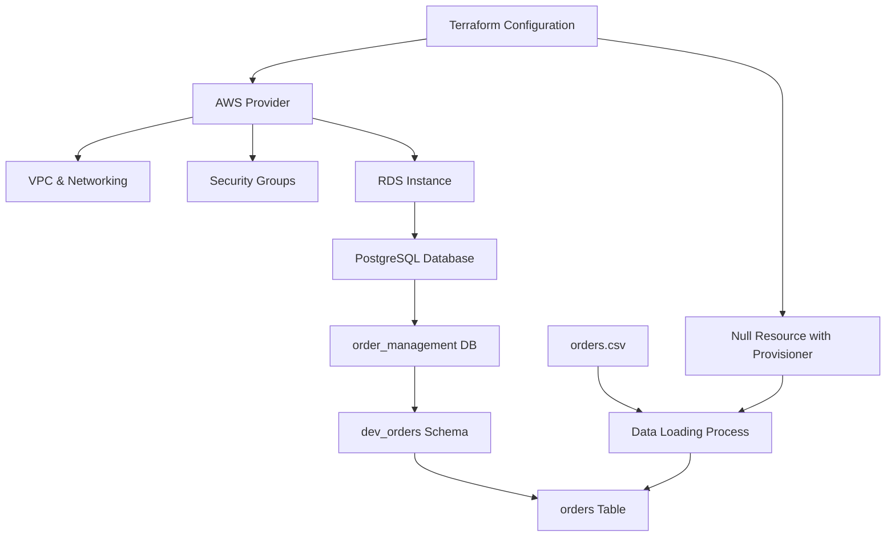
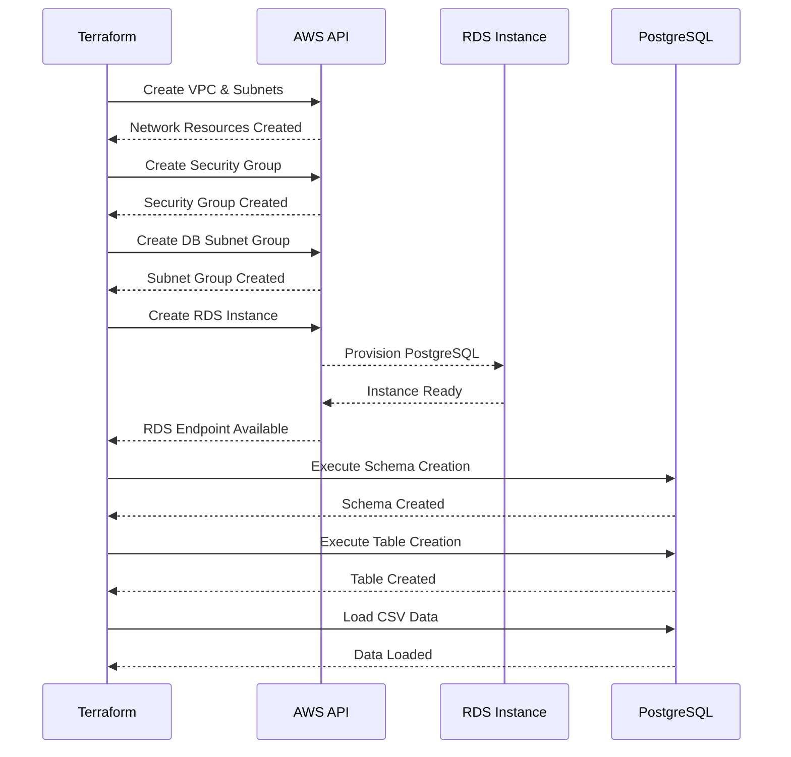

# Design Document: RDS Order Management Setup

## Overview

This design establishes a complete AWS RDS PostgreSQL infrastructure using Terraform for an order management system. The solution provisions a minimal RDS instance, creates the database schema, and automates the initial data load from a CSV file containing approximately 10,000 order records. The infrastructure follows AWS best practices with proper networking, security groups, and parameter configurations while maintaining simplicity for a greenfield deployment.

The system handles the complete lifecycle from infrastructure provisioning through schema creation to data population, ensuring idempotent operations and proper state management through Terraform. The design addresses the challenge of executing database-level operations (schema, table creation, data loading) within Terraform's declarative model.

## Architecture



## Sequence Diagrams

### Infrastructure Provisioning Flow




## Components and Interfaces

### Component 1: Terraform AWS Provider Configuration

**Purpose**: Establishes connection to AWS and defines provider-level settings

**Interface**:
```hcl
provider "aws" {
  region: string
  profile: string (optional)
}
```

**Responsibilities**:
- Authenticate with AWS
- Set default region for resource creation
- Manage provider version constraints

### Component 2: VPC and Network Resources

**Purpose**: Creates isolated network environment for RDS instance

**Interface**:
```hcl
resource "aws_vpc" {
  cidr_block: string
  enable_dns_hostnames: boolean
  enable_dns_support: boolean
}

resource "aws_subnet" {
  vpc_id: string
  cidr_block: string
  availability_zone: string
}

resource "aws_db_subnet_group" {
  name: string
  subnet_ids: list(string)
}
```

**Responsibilities**:
- Provide network isolation
- Enable multi-AZ subnet configuration
- Support DNS resolution for RDS endpoint

### Component 3: Security Group

**Purpose**: Controls network access to RDS instance

**Interface**:
```hcl
resource "aws_security_group" {
  name: string
  vpc_id: string
  
  ingress {
    from_port: number
    to_port: number
    protocol: string
    cidr_blocks: list(string)
  }
  
  egress {
    from_port: number
    to_port: number
    protocol: string
    cidr_blocks: list(string)
  }
}
```

**Responsibilities**:
- Allow PostgreSQL port (5432) access
- Restrict access to specific CIDR ranges
- Enable outbound connectivity


### Component 4: RDS Instance

**Purpose**: Provisions managed PostgreSQL database instance

**Interface**:
```hcl
resource "aws_db_instance" {
  identifier: string
  engine: string
  engine_version: string
  instance_class: string
  allocated_storage: number
  storage_type: string
  db_name: string
  username: string
  password: string
  db_subnet_group_name: string
  vpc_security_group_ids: list(string)
  skip_final_snapshot: boolean
  publicly_accessible: boolean
}
```

**Responsibilities**:
- Provision PostgreSQL engine
- Configure compute and storage resources
- Create initial database
- Manage credentials
- Enable network connectivity

### Component 5: PostgreSQL Provider

**Purpose**: Executes database-level operations (schema, tables, data)

**Interface**:
```hcl
provider "postgresql" {
  host: string
  port: number
  database: string
  username: string
  password: string
  sslmode: string
}

resource "postgresql_schema" {
  name: string
  database: string
}

resource "postgresql_table" {
  schema: string
  name: string
  columns: list(object)
}
```

**Responsibilities**:
- Connect to RDS instance
- Execute DDL statements
- Manage schema objects
- Handle database state

### Component 6: Data Loading Provisioner

**Purpose**: Loads CSV data into orders table

**Interface**:
```hcl
resource "null_resource" {
  provisioner "local-exec" {
    command: string
    environment: map(string)
  }
  
  depends_on: list(resource)
}
```

**Responsibilities**:
- Read orders.csv file
- Transform CSV to SQL INSERT statements
- Execute bulk data load
- Handle errors and retries


## Data Models

### Model 1: RDS Instance Configuration

```hcl
RDSInstanceConfig {
  identifier: string              // Unique identifier for RDS instance
  engine: string                  // "postgres"
  engine_version: string          // "15.4" or latest
  instance_class: string          // "db.t3.micro" for minimal config
  allocated_storage: number       // 20 GB minimum
  storage_type: string            // "gp2" or "gp3"
  db_name: string                 // "order_management"
  username: string                // Master username
  password: string                // Master password (sensitive)
  multi_az: boolean               // false for minimal setup
  publicly_accessible: boolean    // false for security
  skip_final_snapshot: boolean    // true for dev/test
}
```

**Validation Rules**:
- identifier must be lowercase alphanumeric with hyphens
- engine must be "postgres"
- instance_class must be valid AWS instance type
- allocated_storage minimum 20 GB
- password must meet AWS complexity requirements (8+ chars)

### Model 2: Orders Table Schema

```sql
orders {
  row_id: INTEGER PRIMARY KEY
  order_id: VARCHAR(50) NOT NULL
  order_date: DATE
  ship_date: DATE
  ship_mode: VARCHAR(50)
  customer_id: VARCHAR(50)
  customer_name: VARCHAR(100)
  segment: VARCHAR(50)
  country: VARCHAR(100)
  city: VARCHAR(100)
  state: VARCHAR(100)
  postal_code: VARCHAR(20)
  region: VARCHAR(50)
  product_id: VARCHAR(50)
  category: VARCHAR(50)
  sub_category: VARCHAR(50)
  product_name: VARCHAR(255)
  sales: DECIMAL(10,2)
  quantity: INTEGER
  discount: DECIMAL(5,2)
  profit: DECIMAL(10,4)
}
```

**Validation Rules**:
- row_id must be unique and positive
- order_id must not be null
- sales and profit can be negative (returns/losses)
- discount must be between 0 and 1
- dates must be valid and ship_date >= order_date

### Model 3: Network Configuration

```hcl
NetworkConfig {
  vpc_cidr: string                // "10.0.0.0/16"
  subnet_cidrs: list(string)      // ["10.0.1.0/24", "10.0.2.0/24"]
  availability_zones: list(string) // ["us-east-1a", "us-east-1b"]
  db_port: number                 // 5432
  allowed_cidr_blocks: list(string) // IP ranges for access
}
```

**Validation Rules**:
- vpc_cidr must be valid RFC1918 range
- subnet_cidrs must be within vpc_cidr
- At least 2 subnets in different AZs for RDS
- db_port must be 5432 for PostgreSQL


## Algorithmic Pseudocode

### Main Infrastructure Provisioning Algorithm

```pascal
ALGORITHM provisionRDSInfrastructure(config)
INPUT: config of type InfrastructureConfig
OUTPUT: rdsEndpoint of type string

BEGIN
  ASSERT config.isValid() = true
  ASSERT config.region IS NOT NULL
  
  // Step 1: Initialize Terraform state
  terraformState ← initializeTerraformState()
  
  // Step 2: Create network infrastructure
  vpc ← createVPC(config.vpc_cidr)
  ASSERT vpc.state = "available"
  
  subnets ← EMPTY_LIST
  FOR each az IN config.availability_zones DO
    ASSERT length(subnets) < length(config.subnet_cidrs)
    
    subnet ← createSubnet(vpc.id, config.subnet_cidrs[index], az)
    subnets.add(subnet)
  END FOR
  
  ASSERT length(subnets) >= 2
  
  dbSubnetGroup ← createDBSubnetGroup("rds-subnet-group", subnets)
  
  // Step 3: Create security group
  securityGroup ← createSecurityGroup(vpc.id, config.db_port, config.allowed_cidr_blocks)
  ASSERT securityGroup.id IS NOT NULL
  
  // Step 4: Provision RDS instance
  rdsInstance ← createRDSInstance(
    identifier: config.db_identifier,
    engine: "postgres",
    instanceClass: config.instance_class,
    allocatedStorage: config.allocated_storage,
    dbName: "order_management",
    username: config.master_username,
    password: config.master_password,
    subnetGroup: dbSubnetGroup.name,
    securityGroups: [securityGroup.id]
  )
  
  // Step 5: Wait for RDS availability
  WHILE rdsInstance.status != "available" DO
    WAIT 30 seconds
    rdsInstance ← getRDSInstanceStatus(rdsInstance.id)
  END WHILE
  
  ASSERT rdsInstance.endpoint IS NOT NULL
  
  // Step 6: Execute database setup
  dbConnection ← connectToDatabase(rdsInstance.endpoint, config.master_username, config.master_password)
  executeSchemaCreation(dbConnection)
  executeTableCreation(dbConnection)
  
  // Step 7: Load data
  loadOrdersData(dbConnection, "orders.csv")
  
  ASSERT verifyDataLoaded(dbConnection) = true
  
  RETURN rdsInstance.endpoint
END
```

**Preconditions:**
- config is validated and contains all required fields
- AWS credentials are configured and valid
- Terraform is initialized in the working directory
- orders.csv file exists and is readable

**Postconditions:**
- RDS instance is running and accessible
- order_management database exists
- dev_orders schema exists
- orders table exists with all data loaded
- Terraform state reflects all created resources

**Loop Invariants:**
- For subnet creation loop: All previously created subnets are in "available" state
- For RDS availability loop: RDS instance exists and is progressing toward "available" state


### Schema and Table Creation Algorithm

```pascal
ALGORITHM executeSchemaCreation(dbConnection)
INPUT: dbConnection of type DatabaseConnection
OUTPUT: success of type boolean

BEGIN
  ASSERT dbConnection.isConnected() = true
  ASSERT dbConnection.database = "order_management"
  
  // Create schema if not exists
  schemaSQL ← "CREATE SCHEMA IF NOT EXISTS dev_orders"
  
  TRY
    result ← dbConnection.execute(schemaSQL)
    ASSERT result.success = true
  CATCH error
    LOG error.message
    RETURN false
  END TRY
  
  // Verify schema exists
  schemaExists ← dbConnection.query("SELECT schema_name FROM information_schema.schemata WHERE schema_name = 'dev_orders'")
  
  IF schemaExists.rowCount = 0 THEN
    RETURN false
  END IF
  
  RETURN true
END
```

**Preconditions:**
- dbConnection is established and authenticated
- Connected to order_management database
- User has CREATE SCHEMA privilege

**Postconditions:**
- dev_orders schema exists in database
- Returns true if successful, false otherwise
- No side effects if schema already exists (idempotent)

**Loop Invariants:** N/A (no loops)

---

```pascal
ALGORITHM executeTableCreation(dbConnection)
INPUT: dbConnection of type DatabaseConnection
OUTPUT: success of type boolean

BEGIN
  ASSERT dbConnection.isConnected() = true
  
  tableSQL ← "
    CREATE TABLE IF NOT EXISTS dev_orders.orders (
      row_id INTEGER PRIMARY KEY,
      order_id VARCHAR(50) NOT NULL,
      order_date DATE,
      ship_date DATE,
      ship_mode VARCHAR(50),
      customer_id VARCHAR(50),
      customer_name VARCHAR(100),
      segment VARCHAR(50),
      country VARCHAR(100),
      city VARCHAR(100),
      state VARCHAR(100),
      postal_code VARCHAR(20),
      region VARCHAR(50),
      product_id VARCHAR(50),
      category VARCHAR(50),
      sub_category VARCHAR(50),
      product_name VARCHAR(255),
      sales DECIMAL(10,2),
      quantity INTEGER,
      discount DECIMAL(5,2),
      profit DECIMAL(10,4)
    )
  "
  
  TRY
    result ← dbConnection.execute(tableSQL)
    ASSERT result.success = true
  CATCH error
    LOG error.message
    RETURN false
  END TRY
  
  // Verify table exists
  tableExists ← dbConnection.query("
    SELECT table_name 
    FROM information_schema.tables 
    WHERE table_schema = 'dev_orders' 
    AND table_name = 'orders'
  ")
  
  IF tableExists.rowCount = 0 THEN
    RETURN false
  END IF
  
  RETURN true
END
```

**Preconditions:**
- dbConnection is established
- dev_orders schema exists
- User has CREATE TABLE privilege in dev_orders schema

**Postconditions:**
- orders table exists in dev_orders schema
- Table has correct column definitions and constraints
- Returns true if successful, false otherwise
- Idempotent operation (safe to run multiple times)

**Loop Invariants:** N/A (no loops)


### Data Loading Algorithm

```pascal
ALGORITHM loadOrdersData(dbConnection, csvFilePath)
INPUT: dbConnection of type DatabaseConnection, csvFilePath of type string
OUTPUT: rowsLoaded of type integer

BEGIN
  ASSERT dbConnection.isConnected() = true
  ASSERT fileExists(csvFilePath) = true
  
  // Step 1: Check if data already loaded
  existingCount ← dbConnection.query("SELECT COUNT(*) FROM dev_orders.orders")
  
  IF existingCount.value > 0 THEN
    LOG "Data already exists, skipping load"
    RETURN existingCount.value
  END IF
  
  // Step 2: Read CSV file
  csvFile ← openFile(csvFilePath, "read")
  headerLine ← csvFile.readLine()
  ASSERT headerLine IS NOT NULL
  
  // Step 3: Prepare batch insert
  batchSize ← 1000
  currentBatch ← EMPTY_LIST
  totalRows ← 0
  
  // Step 4: Process CSV rows
  WHILE NOT csvFile.endOfFile() DO
    ASSERT totalRows < 1000000  // Safety limit
    
    line ← csvFile.readLine()
    
    IF line IS NULL OR line.isEmpty() THEN
      CONTINUE
    END IF
    
    // Parse CSV line (handle tab-separated values)
    fields ← parseTSVLine(line)
    
    IF length(fields) != 21 THEN
      LOG "Invalid row format, skipping"
      CONTINUE
    END IF
    
    // Transform and validate data
    orderRecord ← transformToOrderRecord(fields)
    
    IF validateOrderRecord(orderRecord) = true THEN
      currentBatch.add(orderRecord)
      totalRows ← totalRows + 1
    ELSE
      LOG "Invalid record, skipping: " + orderRecord.row_id
    END IF
    
    // Execute batch insert when batch is full
    IF length(currentBatch) >= batchSize THEN
      insertBatch(dbConnection, currentBatch)
      currentBatch ← EMPTY_LIST
    END IF
  END WHILE
  
  // Step 5: Insert remaining records
  IF length(currentBatch) > 0 THEN
    insertBatch(dbConnection, currentBatch)
  END IF
  
  csvFile.close()
  
  // Step 6: Verify data loaded
  finalCount ← dbConnection.query("SELECT COUNT(*) FROM dev_orders.orders")
  ASSERT finalCount.value = totalRows
  
  RETURN totalRows
END
```

**Preconditions:**
- dbConnection is established and connected to order_management database
- dev_orders.orders table exists and is empty
- csvFilePath points to valid orders.csv file
- User has INSERT privilege on dev_orders.orders table

**Postconditions:**
- All valid records from CSV are inserted into orders table
- Returns count of rows successfully loaded
- Invalid records are logged but don't stop the process
- Table contains exactly the number of rows returned

**Loop Invariants:**
- All records in currentBatch are validated
- totalRows equals the sum of all successfully validated records
- Database remains in consistent state (no partial batches on error)


### Helper Algorithms

```pascal
ALGORITHM parseTSVLine(line)
INPUT: line of type string
OUTPUT: fields of type list(string)

BEGIN
  ASSERT line IS NOT NULL
  
  fields ← EMPTY_LIST
  currentField ← ""
  
  FOR each character IN line DO
    IF character = TAB THEN
      fields.add(currentField)
      currentField ← ""
    ELSE
      currentField ← currentField + character
    END IF
  END FOR
  
  // Add last field
  fields.add(currentField)
  
  RETURN fields
END
```

---

```pascal
ALGORITHM transformToOrderRecord(fields)
INPUT: fields of type list(string)
OUTPUT: record of type OrderRecord

BEGIN
  ASSERT length(fields) = 21
  
  record ← NEW OrderRecord
  record.row_id ← parseInteger(fields[0])
  record.order_id ← fields[1]
  record.order_date ← parseDate(fields[2], "DD/MM/YY")
  record.ship_date ← parseDate(fields[3], "DD/MM/YY")
  record.ship_mode ← fields[4]
  record.customer_id ← fields[5]
  record.customer_name ← fields[6]
  record.segment ← fields[7]
  record.country ← fields[8]
  record.city ← fields[9]
  record.state ← fields[10]
  record.postal_code ← fields[11]
  record.region ← fields[12]
  record.product_id ← fields[13]
  record.category ← fields[14]
  record.sub_category ← fields[15]
  record.product_name ← fields[16]
  record.sales ← parseDecimal(fields[17])
  record.quantity ← parseInteger(fields[18])
  record.discount ← parseDecimal(fields[19])
  record.profit ← parseDecimal(fields[20])
  
  RETURN record
END
```

---

```pascal
ALGORITHM validateOrderRecord(record)
INPUT: record of type OrderRecord
OUTPUT: isValid of type boolean

BEGIN
  // Check required fields
  IF record.row_id <= 0 THEN
    RETURN false
  END IF
  
  IF record.order_id IS NULL OR record.order_id.isEmpty() THEN
    RETURN false
  END IF
  
  // Validate discount range
  IF record.discount < 0 OR record.discount > 1 THEN
    RETURN false
  END IF
  
  // Validate date logic
  IF record.order_date IS NOT NULL AND record.ship_date IS NOT NULL THEN
    IF record.ship_date < record.order_date THEN
      RETURN false
    END IF
  END IF
  
  RETURN true
END
```

---

```pascal
ALGORITHM insertBatch(dbConnection, records)
INPUT: dbConnection of type DatabaseConnection, records of type list(OrderRecord)
OUTPUT: success of type boolean

BEGIN
  ASSERT dbConnection.isConnected() = true
  ASSERT length(records) > 0
  
  // Build batch INSERT statement
  sql ← "INSERT INTO dev_orders.orders VALUES "
  
  FOR i ← 0 TO length(records) - 1 DO
    ASSERT records[i].isValid() = true
    
    IF i > 0 THEN
      sql ← sql + ", "
    END IF
    
    sql ← sql + formatRecordAsValues(records[i])
  END FOR
  
  TRY
    result ← dbConnection.execute(sql)
    ASSERT result.rowsAffected = length(records)
    RETURN true
  CATCH error
    LOG "Batch insert failed: " + error.message
    RETURN false
  END TRY
END
```

**Preconditions:**
- dbConnection is active
- records list is non-empty
- All records in list are validated

**Postconditions:**
- All records inserted or none (transaction semantics)
- Returns true if all records inserted successfully
- Database state unchanged on failure

**Loop Invariants:**
- SQL statement remains syntactically valid throughout construction
- All processed records are valid


## Key Functions with Formal Specifications

### Function 1: createRDSInstance()

```hcl
resource "aws_db_instance" "orders_db" {
  identifier: string
  engine: string
  instance_class: string
  allocated_storage: number
  username: string
  password: string
}
```

**Preconditions:**
- VPC and subnet group exist
- Security group is configured
- Credentials meet AWS password requirements
- Instance class is valid for the region

**Postconditions:**
- RDS instance is created with status "creating" or "available"
- Instance has unique identifier within AWS account
- Endpoint is available once status is "available"
- Master credentials are set and functional

**Loop Invariants:** N/A (resource creation, not iterative)

### Function 2: createSecurityGroup()

```hcl
resource "aws_security_group" "rds_sg" {
  name: string
  vpc_id: string
  ingress: list(rule)
  egress: list(rule)
}
```

**Preconditions:**
- VPC exists and is available
- Security group name is unique within VPC
- Ingress/egress rules are valid

**Postconditions:**
- Security group is created with unique ID
- All specified rules are active
- Can be attached to RDS instance
- Rules allow PostgreSQL traffic on port 5432

**Loop Invariants:** N/A

### Function 3: executeSQL()

```pascal
function executeSQL(connection: DatabaseConnection, sql: string): Result
```

**Preconditions:**
- connection is established and authenticated
- sql is valid PostgreSQL syntax
- User has necessary privileges for the operation

**Postconditions:**
- SQL statement is executed successfully, or error is returned
- If DDL: schema changes are committed
- If DML: data changes are committed or rolled back on error
- Connection remains open after execution

**Loop Invariants:** N/A

### Function 4: verifyDataLoaded()

```pascal
function verifyDataLoaded(connection: DatabaseConnection): boolean
```

**Preconditions:**
- connection is established
- dev_orders.orders table exists

**Postconditions:**
- Returns true if table contains data (COUNT > 0)
- Returns false if table is empty
- No modifications to database state

**Loop Invariants:** N/A


## Example Usage

### Terraform Configuration Example

```hcl
// Provider configuration
terraform {
  required_providers {
    aws = {
      source  = "hashicorp/aws"
      version = "~> 5.0"
    }
    postgresql = {
      source  = "cyrilgdn/postgresql"
      version = "~> 1.21"
    }
  }
}

provider "aws" {
  region = "us-east-1"
}

// VPC and networking
resource "aws_vpc" "main" {
  cidr_block           = "10.0.0.0/16"
  enable_dns_hostnames = true
  enable_dns_support   = true
}

resource "aws_subnet" "subnet_a" {
  vpc_id            = aws_vpc.main.id
  cidr_block        = "10.0.1.0/24"
  availability_zone = "us-east-1a"
}

resource "aws_subnet" "subnet_b" {
  vpc_id            = aws_vpc.main.id
  cidr_block        = "10.0.2.0/24"
  availability_zone = "us-east-1b"
}

resource "aws_db_subnet_group" "rds_subnet" {
  name       = "rds-subnet-group"
  subnet_ids = [aws_subnet.subnet_a.id, aws_subnet.subnet_b.id]
}

// Security group
resource "aws_security_group" "rds_sg" {
  name   = "rds-security-group"
  vpc_id = aws_vpc.main.id

  ingress {
    from_port   = 5432
    to_port     = 5432
    protocol    = "tcp"
    cidr_blocks = ["10.0.0.0/16"]
  }

  egress {
    from_port   = 0
    to_port     = 0
    protocol    = "-1"
    cidr_blocks = ["0.0.0.0/0"]
  }
}

// RDS instance
resource "aws_db_instance" "orders_db" {
  identifier             = "orders-db"
  engine                 = "postgres"
  engine_version         = "15.4"
  instance_class         = "db.t3.micro"
  allocated_storage      = 20
  storage_type           = "gp2"
  db_name                = "order_management"
  username               = "dbadmin"
  password               = var.db_password
  db_subnet_group_name   = aws_db_subnet_group.rds_subnet.name
  vpc_security_group_ids = [aws_security_group.rds_sg.id]
  skip_final_snapshot    = true
  publicly_accessible    = false
}

// PostgreSQL provider for database operations
provider "postgresql" {
  host     = aws_db_instance.orders_db.address
  port     = 5432
  database = "order_management"
  username = "dbadmin"
  password = var.db_password
  sslmode  = "require"
}

// Create schema
resource "postgresql_schema" "dev_orders" {
  name     = "dev_orders"
  database = "order_management"
  
  depends_on = [aws_db_instance.orders_db]
}

// Data loading provisioner
resource "null_resource" "load_data" {
  provisioner "local-exec" {
    command = <<-EOT
      psql "postgresql://dbadmin:${var.db_password}@${aws_db_instance.orders_db.address}:5432/order_management" <<SQL
        CREATE TABLE IF NOT EXISTS dev_orders.orders (
          row_id INTEGER PRIMARY KEY,
          order_id VARCHAR(50) NOT NULL,
          order_date DATE,
          ship_date DATE,
          ship_mode VARCHAR(50),
          customer_id VARCHAR(50),
          customer_name VARCHAR(100),
          segment VARCHAR(50),
          country VARCHAR(100),
          city VARCHAR(100),
          state VARCHAR(100),
          postal_code VARCHAR(20),
          region VARCHAR(50),
          product_id VARCHAR(50),
          category VARCHAR(50),
          sub_category VARCHAR(50),
          product_name VARCHAR(255),
          sales DECIMAL(10,2),
          quantity INTEGER,
          discount DECIMAL(5,2),
          profit DECIMAL(10,4)
        );
        
        \\COPY dev_orders.orders FROM 'orders.csv' WITH (FORMAT csv, HEADER true, DELIMITER E'\\t');
SQL
    EOT
  }
  
  depends_on = [postgresql_schema.dev_orders]
}

// Outputs
output "rds_endpoint" {
  value = aws_db_instance.orders_db.endpoint
}

output "database_name" {
  value = aws_db_instance.orders_db.db_name
}
```


## Correctness Properties

*A property is a characteristic or behavior that should hold true across all valid executions of a system—essentially, a formal statement about what the system should do. Properties serve as the bridge between human-readable specifications and machine-verifiable correctness guarantees.*

### Property 1: Infrastructure Idempotency

*For any* infrastructure configuration, executing Terraform apply twice with the same configuration should produce no changes on the second execution, with all resources in the same state.

**Validates: Requirements 8.1, 14.2**

### Property 2: Subnet CIDR Containment

*For any* subnet created within the VPC, the subnet's CIDR block must be contained within the VPC's CIDR range.

**Validates: Requirement 1.4**

### Property 3: DB Subnet Group Completeness

*For any* DB subnet group created, it must contain all subnet IDs that were created for the RDS deployment.

**Validates: Requirement 1.5**

### Property 4: Security Group CIDR Restriction

*For any* ingress rule in the security group, the allowed CIDR blocks must match only the specified allowed CIDR blocks.

**Validates: Requirement 2.3**

### Property 5: Network Access Control

*For any* connection attempt to the RDS instance from an IP address outside the allowed CIDR blocks, the connection must be rejected by the security group.

**Validates: Requirement 2.4**

### Property 6: Storage Minimum Threshold

*For any* RDS instance provisioned, the allocated storage must be at least 20 GB.

**Validates: Requirement 3.3**

### Property 7: RDS Endpoint Validity

*For any* RDS instance that reaches "available" status, the instance must provide a valid, non-null endpoint address.

**Validates: Requirement 3.7**

### Property 8: Database Object Idempotency

*For any* database object (schema or table), executing the creation statement multiple times must complete successfully without errors, maintaining the same object state.

**Validates: Requirements 4.3, 5.6, 8.2, 8.3**

### Property 9: Data Load Idempotency

*For any* orders table that already contains data, executing the data load operation must skip loading and leave the existing data unchanged.

**Validates: Requirements 6.2, 8.4**

### Property 10: CSV Parsing Consistency

*For any* valid CSV line with 21 tab-separated fields, parsing the line must return exactly 21 fields.

**Validates: Requirement 6.4**

### Property 11: Record Validation Enforcement

*For any* CSV record processed, the CSV_Loader must execute validation before attempting insertion.

**Validates: Requirement 6.5**

### Property 12: Invalid Record Handling

*For any* CSV record that fails validation, the CSV_Loader must log the error and skip that record without halting the entire load process.

**Validates: Requirement 6.6**

### Property 13: Data Completeness

*For any* data load operation, the count of rows in the dev_orders.orders table must equal the count of valid records from the CSV file.

**Validates: Requirement 6.8**

### Property 14: Discount Range Validation

*For any* order record with a discount value less than 0 or greater than 1, the validation must reject the record.

**Validates: Requirement 7.3**

### Property 15: Date Logic Validation

*For any* order record where both order_date and ship_date are present, if ship_date is before order_date, the validation must reject the record.

**Validates: Requirement 7.4**

### Property 16: Batch Insert Atomicity

*For any* batch of records being inserted, either all records in the batch are inserted successfully, or no records from the batch are inserted (all-or-nothing).

**Validates: Requirement 10.4**

### Property 17: Sensitive Data Redaction

*For any* output or log message generated by Terraform, password values and other sensitive credentials must not be exposed in plain text.

**Validates: Requirements 11.4, 15.4**

### Property 18: State Recording Completeness

*For any* resource created by Terraform, the resource ID must be recorded in the Terraform state file.

**Validates: Requirement 14.1**

### Property 19: Endpoint Format Consistency

*For any* RDS endpoint output, the format must be "host:port" where host is a valid hostname and port is a valid port number.

**Validates: Requirement 15.3**


## Error Handling

### Error Scenario 1: RDS Instance Creation Failure

**Condition**: AWS API returns error during RDS instance creation (insufficient capacity, quota exceeded, invalid parameters)

**Response**: 
- Terraform captures error and halts execution
- No partial resources are left in inconsistent state
- Error message includes specific AWS error code and description

**Recovery**:
- Review error message and adjust configuration (instance class, region, etc.)
- Run `terraform destroy` to clean up any partial resources
- Correct configuration and re-run `terraform apply`

### Error Scenario 2: Database Connection Failure

**Condition**: Cannot establish connection to RDS instance after provisioning (network issues, security group misconfiguration, credentials invalid)

**Response**:
- PostgreSQL provider fails with connection timeout or authentication error
- Terraform marks dependent resources as failed
- RDS instance remains running but unusable

**Recovery**:
- Verify security group rules allow traffic from execution environment
- Check RDS instance status in AWS console
- Validate credentials in Terraform variables
- Test connection manually using psql client
- Update security group or credentials and re-apply

### Error Scenario 3: CSV File Not Found

**Condition**: orders.csv file does not exist at expected path during data load

**Response**:
- null_resource provisioner fails with file not found error
- Table is created but remains empty
- Terraform execution fails

**Recovery**:
- Verify orders.csv exists in working directory
- Check file path in provisioner command
- Re-run `terraform apply` after placing file correctly

### Error Scenario 4: Data Validation Failure

**Condition**: CSV contains invalid records (malformed dates, negative row_id, discount > 1)

**Response**:
- Invalid records are logged and skipped
- Valid records are still inserted
- Warning logged for each skipped record

**Recovery**:
- Review logs to identify invalid records
- Correct source data if needed
- Manually insert corrected records or re-run load process

### Error Scenario 5: Insufficient Privileges

**Condition**: Database user lacks CREATE SCHEMA or CREATE TABLE privileges

**Response**:
- PostgreSQL returns permission denied error
- Schema or table creation fails
- Terraform execution halts

**Recovery**:
- Grant necessary privileges to master user
- Verify user has CREATEDB and CREATEROLE privileges
- Re-run terraform apply

### Error Scenario 6: Duplicate Data Load

**Condition**: Attempting to load data when orders table already contains records

**Response**:
- Data load algorithm checks existing row count
- If count > 0, skip load and log message
- No duplicate data inserted

**Recovery**:
- No action needed (idempotent behavior)
- To reload data: manually truncate table and re-run provisioner

### Error Scenario 7: Network Timeout During Provisioning

**Condition**: Network interruption during long-running operations (RDS creation, data load)

**Response**:
- Terraform operation times out
- Partial state may be saved
- Resources may be in intermediate state

**Recovery**:
- Run `terraform refresh` to sync state with actual resources
- Review AWS console for resource status
- Run `terraform apply` to complete provisioning
- If resources are stuck, manually intervene via AWS console


## Testing Strategy

### Unit Testing Approach

**Terraform Configuration Validation**:
- Use `terraform validate` to check syntax and configuration correctness
- Test variable validation rules with valid and invalid inputs
- Verify resource dependencies are correctly specified
- Test with different AWS regions and instance types

**Key Test Cases**:
1. Valid minimal configuration passes validation
2. Invalid instance class is rejected
3. Missing required variables cause appropriate errors
4. CIDR block overlaps are detected
5. Password complexity requirements are enforced

**Coverage Goals**: 100% of Terraform resources and variables validated

### Property-Based Testing Approach

**Property Test Library**: Hypothesis (Python) or QuickCheck (Haskell) for data validation logic

**Properties to Test**:

1. **CSV Parsing Property**:
   - Generate random CSV lines with 21 tab-separated fields
   - Property: parseTSVLine always returns exactly 21 fields
   - Property: Parsing is reversible (parse then join equals original)

2. **Date Validation Property**:
   - Generate random order and ship dates
   - Property: If both dates valid, ship_date >= order_date or validation fails
   - Property: Invalid date formats are rejected

3. **Discount Range Property**:
   - Generate random discount values
   - Property: validateOrderRecord returns false for discount < 0 or > 1
   - Property: Valid discounts (0 to 1) pass validation

4. **Batch Insert Property**:
   - Generate random batch sizes (1 to 10000 records)
   - Property: insertBatch with N valid records inserts exactly N rows
   - Property: Batch insert is atomic (all or nothing)

5. **Idempotency Property**:
   - Run provisionRDSInfrastructure twice with same config
   - Property: Second run produces no changes
   - Property: Resource count remains constant

### Integration Testing Approach

**Test Environment**: Use localstack or AWS test account with isolated VPC

**Integration Test Scenarios**:

1. **End-to-End Provisioning Test**:
   - Run complete terraform apply
   - Verify RDS instance is accessible
   - Verify schema and table exist
   - Verify data is loaded correctly
   - Run terraform destroy and verify cleanup

2. **Network Connectivity Test**:
   - Provision infrastructure
   - Attempt connection from allowed CIDR
   - Verify connection succeeds
   - Attempt connection from disallowed CIDR
   - Verify connection is rejected

3. **Data Load Test**:
   - Create test CSV with known record count
   - Run data load process
   - Query database and verify exact count matches
   - Verify sample records for data accuracy

4. **Failure Recovery Test**:
   - Simulate RDS creation failure
   - Verify terraform state is consistent
   - Verify no orphaned resources
   - Retry and verify success

5. **Schema Isolation Test**:
   - Create multiple schemas
   - Verify tables in dev_orders are isolated
   - Verify cross-schema queries work as expected

**Test Execution**:
- Run integration tests in CI/CD pipeline
- Use separate AWS account or isolated VPC
- Clean up all resources after each test
- Capture and analyze Terraform logs

**Success Criteria**:
- All integration tests pass consistently
- No manual intervention required
- Infrastructure can be created and destroyed cleanly
- Data integrity is maintained throughout process


## Performance Considerations

### RDS Instance Sizing

**Minimal Configuration**:
- Instance class: db.t3.micro (2 vCPU, 1 GB RAM)
- Storage: 20 GB gp2 (baseline 100 IOPS)
- Suitable for: Development, testing, small datasets (<100K rows)

**Performance Characteristics**:
- Initial data load (~10K rows): 5-10 seconds
- Query response time: <100ms for simple queries
- Concurrent connections: Up to 100 (PostgreSQL default)

**Scaling Considerations**:
- For production: Use db.t3.small or larger
- For high IOPS: Switch to gp3 or io1 storage
- For high availability: Enable multi_az = true
- For read-heavy workloads: Add read replicas

### Data Loading Optimization

**Batch Insert Strategy**:
- Batch size: 1000 records per INSERT statement
- Reduces round trips to database
- Balances memory usage and performance

**Alternative Approaches**:
- Use PostgreSQL COPY command for faster bulk load (implemented in example)
- COPY is 2-3x faster than INSERT for large datasets
- Disable indexes during load, rebuild after (for very large datasets)

**Expected Performance**:
- 10K rows via COPY: 2-5 seconds
- 10K rows via batch INSERT: 10-15 seconds
- 100K rows via COPY: 20-30 seconds

### Network Performance

**Latency Considerations**:
- RDS in same VPC as application: <1ms latency
- Cross-region access: 50-200ms latency (not recommended)
- Public internet access: Variable, depends on connection

**Optimization**:
- Keep RDS and application in same availability zone for lowest latency
- Use VPC endpoints for AWS service access
- Enable connection pooling in application layer

### Terraform Execution Time

**Typical Execution Times**:
- Initial apply (create all resources): 8-12 minutes
- RDS instance creation: 5-8 minutes (majority of time)
- Network resources: 1-2 minutes
- Data load: <1 minute

**Optimization**:
- Use terraform parallelism flag: `terraform apply -parallelism=10`
- Cache provider plugins
- Use remote state for team collaboration


## Security Considerations

### Network Security

**VPC Isolation**:
- RDS instance deployed in private subnets
- No direct internet access (publicly_accessible = false)
- Access controlled via security groups

**Security Group Rules**:
- Ingress: Only PostgreSQL port 5432 from specific CIDR blocks
- Egress: Restricted to necessary outbound traffic
- Principle of least privilege applied

**Recommendations**:
- Use VPN or bastion host for administrative access
- Restrict CIDR blocks to known application subnets
- Enable VPC Flow Logs for network monitoring

### Credential Management

**Current Approach**:
- Master password stored in Terraform variables
- Passed as sensitive variable

**Security Risks**:
- Password may appear in Terraform state file
- State file should be encrypted and access-controlled

**Recommendations**:
- Use AWS Secrets Manager for password storage
- Rotate credentials regularly
- Use IAM database authentication where possible
- Never commit passwords to version control

**Enhanced Configuration**:
```hcl
data "aws_secretsmanager_secret_version" "db_password" {
  secret_id = "rds/orders-db/master-password"
}

resource "aws_db_instance" "orders_db" {
  password = data.aws_secretsmanager_secret_version.db_password.secret_string
  # ... other configuration
}
```

### Data Encryption

**Encryption at Rest**:
- Enable storage_encrypted = true for RDS instance
- Use AWS KMS for key management
- Encrypts database storage, backups, and snapshots

**Encryption in Transit**:
- Enforce SSL/TLS connections
- Set sslmode = "require" in PostgreSQL provider
- Use RDS certificate authority for validation

**Enhanced Configuration**:
```hcl
resource "aws_db_instance" "orders_db" {
  storage_encrypted = true
  kms_key_id       = aws_kms_key.rds_key.arn
  # ... other configuration
}
```

### Access Control

**Database Privileges**:
- Master user has full privileges (necessary for setup)
- Create separate application user with limited privileges
- Grant only SELECT, INSERT, UPDATE, DELETE on orders table

**Terraform State Security**:
- Store state in S3 with encryption
- Enable versioning for state recovery
- Use DynamoDB for state locking
- Restrict IAM access to state bucket

**Audit Logging**:
- Enable RDS Enhanced Monitoring
- Enable PostgreSQL log_statement = 'all' for audit trail
- Export logs to CloudWatch Logs
- Set up alerts for suspicious activity

### Compliance Considerations

**Data Privacy**:
- Orders data contains customer PII (names, addresses)
- Consider data masking for non-production environments
- Implement data retention policies
- Ensure compliance with GDPR, CCPA if applicable

**Backup and Recovery**:
- Enable automated backups (backup_retention_period = 7)
- Test restore procedures regularly
- Consider cross-region backup replication for DR


## Dependencies

### Terraform Providers

**AWS Provider**:
- Source: hashicorp/aws
- Version: ~> 5.0
- Purpose: Provision AWS infrastructure resources
- Documentation: https://registry.terraform.io/providers/hashicorp/aws

**PostgreSQL Provider**:
- Source: cyrilgdn/postgresql
- Version: ~> 1.21
- Purpose: Manage PostgreSQL database objects (schemas, tables)
- Documentation: https://registry.terraform.io/providers/cyrilgdn/postgresql

**Null Provider**:
- Source: hashicorp/null
- Version: ~> 3.2
- Purpose: Execute local provisioners for data loading
- Documentation: https://registry.terraform.io/providers/hashicorp/null

### External Tools

**PostgreSQL Client (psql)**:
- Version: 15.x or compatible
- Purpose: Execute SQL commands and COPY operations
- Installation: `apt-get install postgresql-client` (Ubuntu/Debian)
- Required for: Data loading via local-exec provisioner

**Terraform CLI**:
- Version: >= 1.5.0
- Purpose: Infrastructure orchestration
- Installation: https://www.terraform.io/downloads

### AWS Services

**Amazon RDS**:
- Service: Relational Database Service
- Engine: PostgreSQL 15.4
- Purpose: Managed database hosting

**Amazon VPC**:
- Service: Virtual Private Cloud
- Purpose: Network isolation and security

**AWS IAM**:
- Service: Identity and Access Management
- Purpose: Authentication and authorization for Terraform

### File Dependencies

**orders.csv**:
- Location: Working directory (same as Terraform files)
- Format: Tab-separated values with header row
- Size: ~10,000 rows, 21 columns
- Encoding: UTF-8
- Required: Must exist before running terraform apply

### Environment Variables

**AWS Credentials**:
- AWS_ACCESS_KEY_ID
- AWS_SECRET_ACCESS_KEY
- AWS_REGION (optional, can be set in provider)

**Terraform Variables**:
- TF_VAR_db_password: Master database password
- TF_VAR_region: AWS region (optional)

### Network Requirements

**Outbound Connectivity**:
- Access to AWS API endpoints (*.amazonaws.com)
- Access to Terraform Registry (registry.terraform.io)
- Access to provider plugin repositories

**Inbound Connectivity**:
- None required for Terraform execution
- Application access to RDS requires appropriate security group rules

